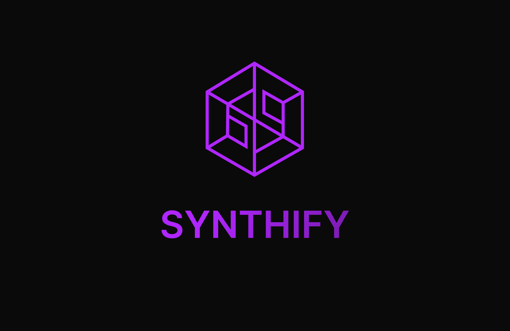

**Synthify: Generate Synthesized Datasets for Large Language Models and Vision Language Models with a no-code UI**



### Quick Start Guide

Welcome to Synthify! Follow these steps to get started quickly:

#### Step 1: Setting up Domains

To run Synthify locally, you'll need to set up some fake domains. Don't worry; it's easy!

1. **For macOS:**
   - Open Terminal.
   - Type `sudo nano /etc/hosts` and press Enter.
   - Add these lines to the end of the file:
     ```
     127.0.0.1 pb.example.io
     127.0.0.1 backend.example.io
     127.0.0.1 party.example.io
     127.0.0.1 example.io
     ```
   - Save and exit by pressing `Ctrl + X`, then `Y`, and finally `Enter`.

2. **For Windows and Linux:**  
   - Google "How to edit hosts file [your operating system]" for instructions.

#### Step 2: Running Synthify

Now, let's start Synthify using Docker:

1. Make sure you have Docker installed. If not, download and install it from [here](https://www.docker.com/get-started).

2. Open Terminal or Command Prompt.

3. Type `docker-compose up -d` and press Enter. This command will launch all the necessary services.

#### Step 3: Setting up Admin User

1. Go to [http://pb.example.io/_](http://pb.example.io/_).
   
2. Set up an admin user.

3. Copy the email and password you used.

4. Open the `.env` file in your project directory.

5. Set `POCKETBASE_EMAIL` to the email you just created and `POCKETBASE_PASSWORD` to the password.

6. Set `BACKEND_HOST`, `PARTY_HOST`, and `POCKETBASE_HOST` to `https://backend.example.io`, `https://party.example.io`, and `https://pb.example.io` respectively.

7. Save the `.env` file.

8. Restart Docker Compose by typing `docker-compose restart` and pressing Enter.

#### Step 4: Importing Database Schema

1. Open [http://pb.example.io/_/#/settings/import-collections](http://pb.example.io/_/#/settings/import-collections) in your browser.

2. Paste the content of the `pb_schema.json` file located at `app/packages/backend/pb_schema.json` into the "Collections" field.

3. Save the changes.

#### Step 5: Enjoy Synthify!

1. Open [http://example.io](http://example.io) in your browser.

2. Set up a user.

3. You're all set to enjoy Synthify!

### Contributing

We love contributions! Feel free to open issues, submit pull requests, or suggest new features on our [GitHub repository](https://github.com/amirrezasalimi/synthify).

### License

Synthify is licensed under the [Creative Commons Attribution-NonCommercial-ShareAlike 4.0 International Public License](https://creativecommons.org/licenses/by-nc-sa/4.0/legalcode). Refer to the [LICENSE](LICENSE) file for more details.

This license allows you to share and adapt the material for non-commercial purposes under certain conditions.

